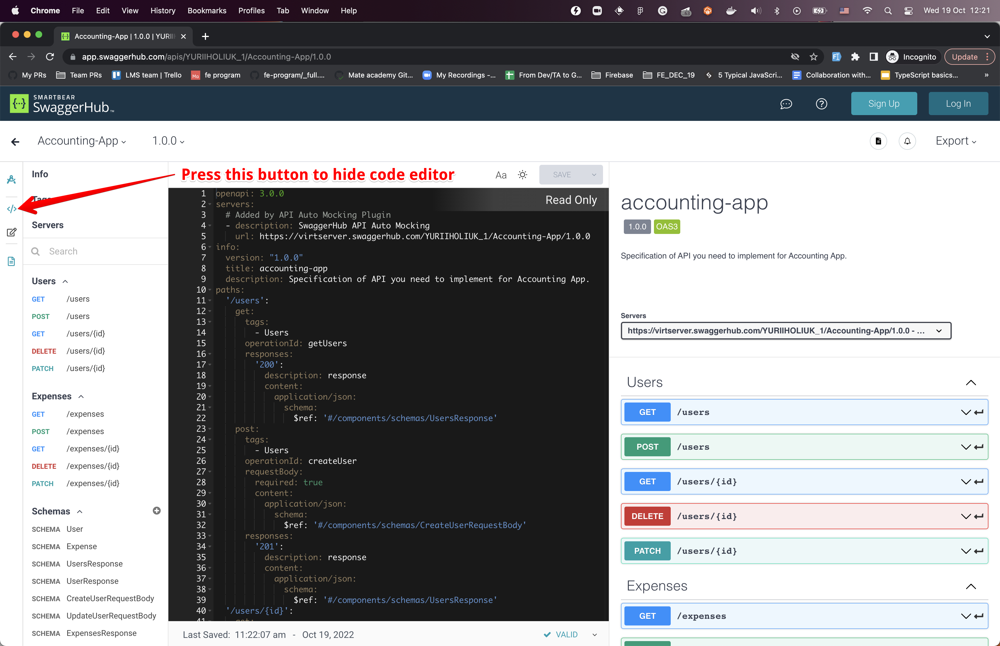
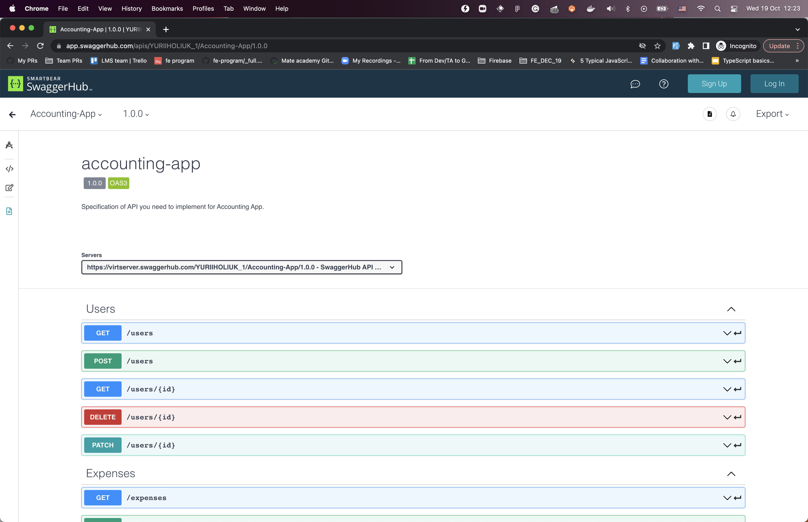

# Бухгалтерський застосунок (на Node.js)

Реалізуйте застосунок для обліку витрат.
Потрібно реалізувати 2 колекції з 5 ендпоінтами у кожній.

## Бізнес-вимоги
Вони детально описані в [документації](https://app.swaggerhub.com/apis/YURIIHOLIUK_1/Accounting-App/1.0.0)

  
Як працювати з документацією

  Якщо відкрити ендпоінт, ви побачите параметри запиту та тіло. А також очікувану відповідь.
  Також можна використати кнопку `Try it out`, а потім `Execute`, щоб надіслати запит на мок-сервер.
  Він поверне вам демо-відповідь.

  Можна приховати зайвий редактор коду в документації:
  
  Результат:
  

## Технічні вимоги

Окрім позитивних сценаріїв, для кожного запиту потрібно:
- повертати 404 з будь-яким повідомленням, якщо очікувана сутність не існує.
- повертати 400 з будь-яким повідомленням, якщо не передано обов’язковий параметр.

Ця поведінка описана в тестах (очікується та перевіряється тестами).

Дані спочатку мають бути порожніми. Зберігати дані в пам’яті (просто в коді, у якійсь змінній).
Зміни мають зберігатися, поки сервер працює.
Тобто якщо я створю витрату першим POST-запитом, вона має повертатися другим GET-запитом.

Але після зупинки та повторного запуску сервера дані мають бути порожніми.

### Вимоги до коду
Працювати потрібно у файлі `src/createServer.js`.
Потрібно створити, налаштувати та повернути express-додаток з функції `createServer`.
> ❗️Не варто викликати `app.listen(...)`. Це робиться в тестах та в `main.js`
Можна створювати додаткові файли, а можна й ні, але ніхто не гарантує схвалення ментором 😉.

## Як працювати
- `npm run dev` — запуск сервера з автоматичним перезапуском при зміні коду.
- `npm start` — просто запускає сервер.
- `npm run test:watch` — **[Рекомендовано]** запускає тести в режимі watch (автоматичний перезапуск при змінах).
- `npm test` — один раз запускає ESLint та тести.
- `npm run lint` — запускає ESLint.
- `npm run lint:fix` — запускає ESLint і виправляє те, що можна виправити автоматично.
